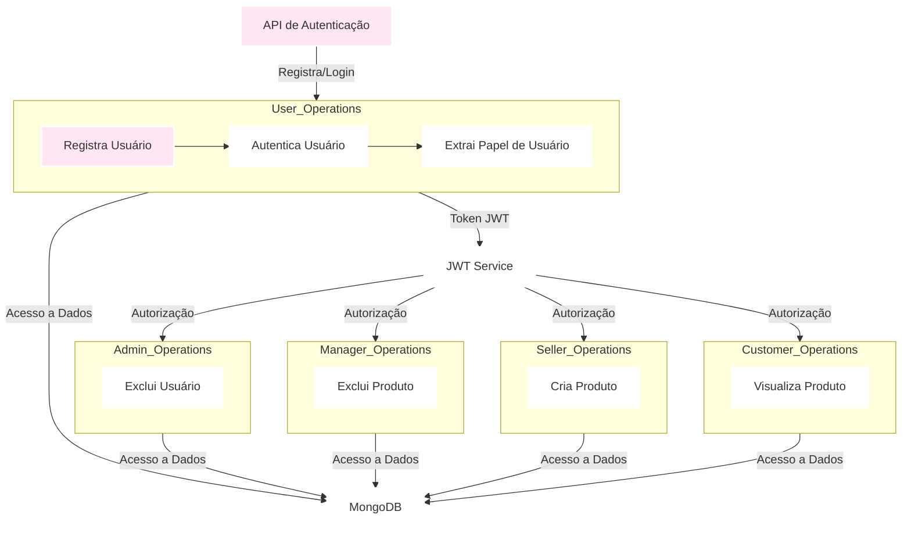

# Prova Final - Aplicação Spring Boot

## Descrição do Projeto:
Implementação de um sistema de autenticação e autorização de usuários utilizando Spring Boot e JWT (JSON Web Token). O sistema permite o registro, login e controle de acesso baseado em funções de usuário, como ADMIN, GERENTE (encarregada), VENDEDOR e CLIENTE.

## Funcionalidades:

### Parte 1: Autenticação de usuários 
- **Registro de Usuário:** Permite que novos usuários se registrem com nome de usuário, senha e e-mail. Cada usuário é identificado com uma das seguintes funções: administrador, gerente de produtos, vendedor ou cliente.
- **Login Seguro:** Permite que os usuários se autentiquem utilizando suas credenciais (nome de usuário e senha). As credenciais são verificadas em relação aos dados armazenados no banco de dados.
- **Geração de Token JWT:** Após um login bem-sucedido, um token JWT é gerado, contendo informações como ID do usuário, tipo de conta e e-mail.

### Parte 2: Controle de Acesso com JWT 
- **Endpoints Baseados em Funções:** Implementa endpoints que permitem o acesso baseado nas funções dos usuários, garantindo que apenas usuários autorizados possam acessar determinados recursos.
  - **Administradores:** Endpoint para gerenciamento de usuários (criação, atualização e exclusão). Exemplo: `POST /admin/users`
  - **Gerentes de Produtos:** Endpoint para gerenciamento de produtos e categorias. Exemplo: `POST /manager/products`
  - **Vendedores:** Endpoint para gerenciamento de pedidos e devoluções. Exemplo: `POST /seller/orders`
  - **Clientes:** Endpoint para acesso ao catálogo de produtos e histórico de pedidos. Exemplo: `GET /customer/products`

## Estrutura do Projeto
- **Pacote com.example.ProvaFinal.application**
  - `ProvaFinalApplication.java`: Classe principal que inicia a aplicação Spring Boot.
- **Pacote com.example.ProvaFinal.config**
  - `SecurityConfig.java`: Configurações de segurança para a aplicação, definindo as regras de autorização e os usuários em memória com suas respectivas funções.
- **Pacote com.example.ProvaFinal.controller**
  - `UsuarioController.java`: Controlador responsável pelas operações de login, extração de nome de usuário a partir do token JWT e verificação de funções específicas dos usuários.
- **Pacote com.example.ProvaFinal.model**
  - `UsuarioEntity.java`: Classe que representa a entidade de usuário com atributos como id, nome, email e senha.
- **Pacote com.example.ProvaFinal.security**
  - `JwtUtil.java`: Classe utilitária para geração e extração de informações de tokens JWT.
- **Pacote com.example.ProvaFinal.service**
  - `UsuarioService.java`: Serviço responsável por gerar tokens JWT e extrair nomes de usuário a partir dos tokens.

## Print do funcionamento do sistema:

## Abaixo segue diagrama da aplicação:

